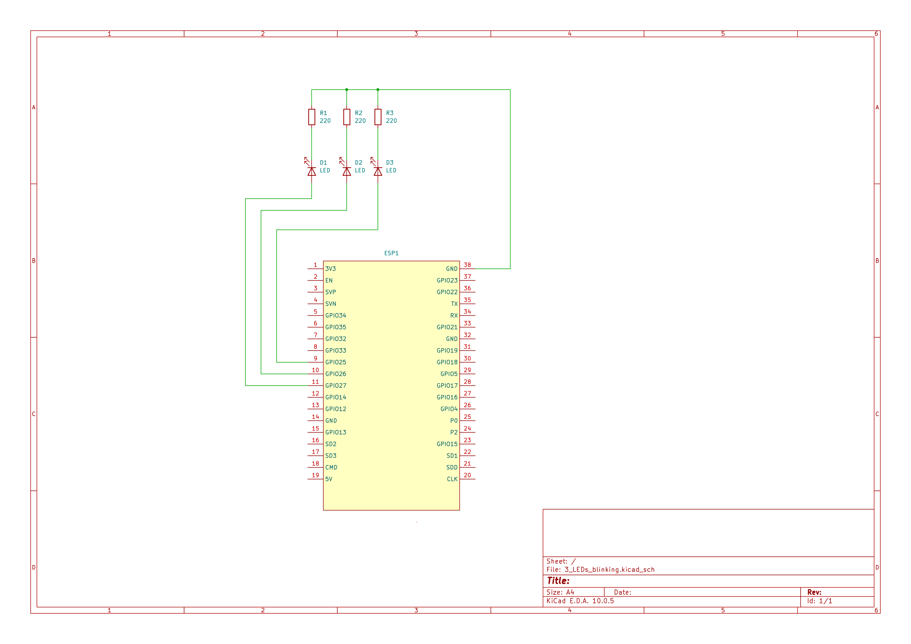

# ESP-32 Three Blinking LEDs

Simple LED Test project with ESP32 Development Board for three blinking LEDs in a sequence

## Setup

* **IDE:** VS Code with extension **PlatformIO IDE**.
* **Framework:** Arduino
* **Hardware:** ESP32 Development Board (NodeMCU ESP32) + 3 LEDs (red,yellow,greeen) + 3 resistors (220 Ohm)

## Schematic 
1. GPIO Pins (Anode,+) on ESP32 connected to a resistor (220 Ohm)
2. Resistors connected to Anode (+) of the LED
3. Cathode (-) of the LED connected to GND on ESP32




## Code (`src/main.cpp`)

```cpp
#include <Arduino.h>

// Define the GPIOs on the ESP32, in this example GPIOs 25,26 and 27:
const int led1 = 25;
const int led2 = 26;
const int led3 = 27;

void setup() {
  // Configure GPIOs as Output
  pinMode(led1, OUTPUT);
  pinMode(led2, OUTPUT);
  pinMode(led3, OUTPUT);
}


void loop() {
//  Turn on and off the LEDs 

  digitalWrite(led1, HIGH); // LED 1 on --> GPIO is set on 3,3 V (HIGH)
  delay(500); // wait 500 ms
  digitalWrite(led1, LOW); // LED 1 off --> GIPO is set on 0 Volt (LOW)
  
  // LED 2 an
  digitalWrite(led2, HIGH); // LED 1 on --> GPIO is set on 3,3 V (HIGH)
  delay(500); // wait 500 ms
  digitalWrite(led2, LOW); // LED 1 off --> GIPO is set on 0 Volt (LOW)
  
  // LED 3 an
  digitalWrite(led3, HIGH); // LED 1 on --> GPIO is set on 3,3 V (HIGH)
  delay(500); // wait 500 ms
  digitalWrite(led3, LOW); // LED 1 off --> GIPO is set on 0 Volt (LOW)
}

```

## PlatformIO configuration (`platformio.ini`)

```ini
[env:esp32dev]
platform = espressif32
board = esp32dev
framework = arduino
monitor_speed = 115200
```


## Execute
1. Connect ESP32 with USB to your computer.
2. Click in the status bar in VS code (PlatformIO Symbols) on the checkmark to build the code.
3. Click on the arrow (Upload) to transform the code on the ESP32