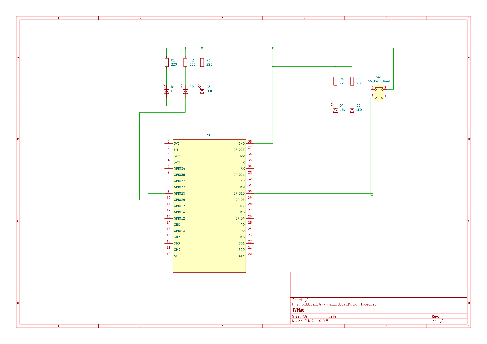

# ESP-32 3 blinking LEDs + switch button between 2 extra LEDs

Simple LED Test project with ESP32 Development Board for three blinking LEDs in a sequence + a switch button between two extra LEDs

Here we used millis() instead of delay() in the main loop for the reason to run two different tasks on the ESP32 at the same time.
This would nbot be possible with the delay() command.

## Setup

* **IDE:** VS Code with extension **PlatformIO IDE**.
* **Framework:** Arduino
* **Hardware:** ESP32 Development Board (NodeMCU ESP32) + 5 LEDs (red,yellow,greeen, 2x blue) + 5 resistors (220 Ohm)

## Schematic 
1. GPIO Pins (Anode,+) on ESP32 connected to a resistor (220 Ohm)
2. Resistors connected to Anode (+) of the LED
3. Cathode (-) of the LEDs connected to GND on ESP32

git


## Code (`src/main.cpp`)

```cpp
Look up in src
```


## Execute
1. Connect ESP32 with USB to your computer.
2. Click in the status bar in VS code (PlatformIO Symbols) on the checkmark to build the code.
3. Click on the arrow (Upload) to transform the code on the ESP32