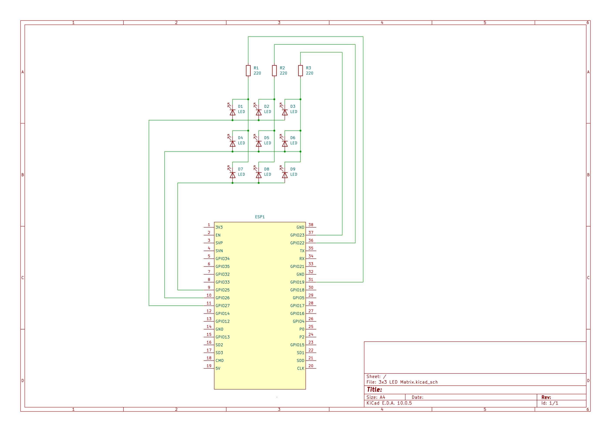

# ESP-32 Single Target LED in a 3x3 LED matrix

In this Setup, we target a single LED in a 3x3 LED matrix.


## Setup

* **IDE:** VS Code with extension **PlatformIO IDE**.
* **Framework:** Arduino
* **Hardware:** ESP32 Development Board (NodeMCU ESP32) + 9 LEDs in a 3x3 matrix (Common anode) + 3 resistors (220 Ohm)

## Schematic 
GPIO Pins 27, 26 and 25 are connected to Rows 1,2 and 3 of the LED matrix respectively. Columns 1, 2 and 3 of the matrix are connected via a 220 Ohm resistor on ESP32 to the GPIO Pins 31, 36 and 37 respectively.



## Code (`src/main.cpp`)

```cpp
Look up in src
```

## Target the LED

In the source code under "configuration" (2. Define target LED) you choose the LED you want to target, e. g. LED of ROW1 and COL2:

// ############################################
// ****** CONFIGURATION ******
// ############################################

// 1. Configuration of rows and columns GPIOs
//              ROW  1   2   3 (Indexing: 0,1,2)
const int ROWS[] = {27, 26, 25};

//              COL  1   2   3 (Indexing: 0,1,2)
const int COLS[] = {23, 22, 19};
const int size_of_Matrix = sizeof(ROWS) / sizeof(ROWS[0]); // only for squared Matrix


// 2. Define target LED
// Example: Row 1, Column 2 -> GPIO 27 and GPIO 22
const int TARGET_ROW_INDEX = 0;
const int TARGET_COL_INDEX = 1;