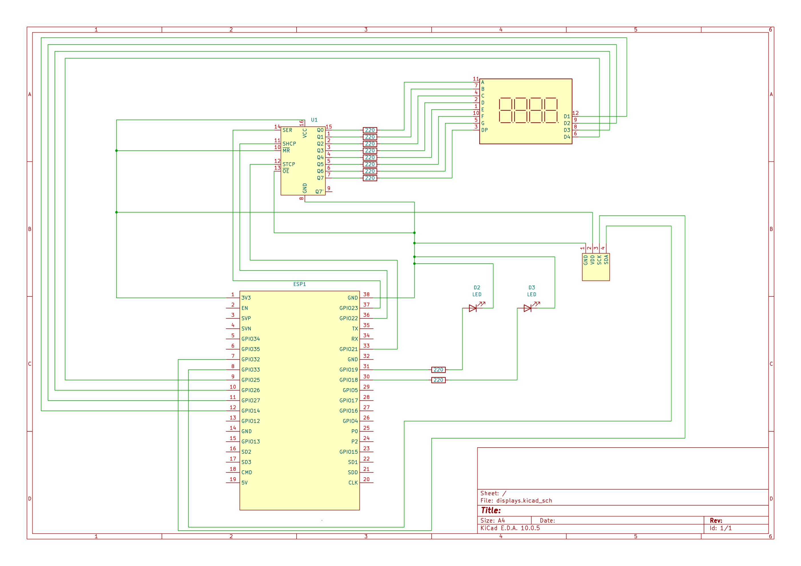

# Online Pong + Score displays connected to ESP32 via WiFi

A two-player online Pong game with a physical scoreboard. The game runs over a private [Tailscale](https://tailscale.com/) network, and an ESP32 shows the live score on a 4-digit 7-segment display (3641AS) and an OLED, with one LED per player that lights up whenever that player scores.


## Setup

* **IDE:** VS Code with extension **PlatformIO IDE**.
* **Framework:** Arduino
* **Hardware:** 
- ESP32 Development Board (NodeMCU ESP32)
- 4-digit 7-segment display (3641AS)
- OLED display
- 74HC595 shift register
- 10 resistors 220 Ohm

## Schematic 
===================================================================
COMPLETE WIRING DIAGRAM: ESP32 + SN74HC595N + 4-DIGIT DISPLAY + OLED + 2 LEDs
===================================================================
System Voltage: 3.3V (Safe operation for ESP32 and shift register)

POWER SUPPLY NOTE:
Use the long lateral power rails (+ and -) of your breadboard.
- ESP32 Pin '3V3' -> Connect to the positive rail (+) of the breadboard
- ESP32 Pin 'GND' -> Connect to the negative rail (-) of the breadboard

-------------------------------------------------------------------
1. CONNECTING THE SHIFT REGISTER (SN74HC595N)
-------------------------------------------------------------------
IC Pin 8 (GND)       -> Negative rail (-) [Ground]
IC Pin 10 (/MR)      -> Positive rail (+)  [Master Reset disabled]
IC Pin 11 (SHCP)     -> ESP32 GPIO 22     [Shift Register Clock]
IC Pin 12 (STCP)     -> ESP32 GPIO 21      [Storage Register Clock / Latch]
IC Pin 13 (/OE)      -> Negative rail (-) [Output Enable permanently active]
IC Pin 14 (DS)       -> ESP32 GPIO 23     [Serial Data Input / Data Line]
IC Pin 16 (VCC)      -> Positive rail (+)  [3.3V Power Supply]

-------------------------------------------------------------------
2. SHIFT REGISTER (OUTPUTS) TO 7-SEGMENT DISPLAY (SEGMENTS)
-------------------------------------------------------------------
* Important: Each segment requires its own 220 Ohm current-limiting resistor!
* Connect each resistor between the IC pin and the corresponding display pin.

IC Pin 15 (Q0) -> [220 Ohm Resistor] -> Segment A
IC Pin 1  (Q1) -> [220 Ohm Resistor] -> Segment B
IC Pin 2  (Q2) -> [220 Ohm Resistor] -> Segment C
IC Pin 3  (Q3) -> [220 Ohm Resistor] -> Segment D
IC Pin 4  (Q4) -> [220 Ohm Resistor] -> Segment E
IC Pin 5  (Q5) -> [220 Ohm Resistor] -> Segment F
IC Pin 6  (Q6) -> [220 Ohm Resistor] -> Segment G
IC Pin 7  (Q7) -> [220 Ohm Resistor] -> Decimal Point (DP)

-------------------------------------------------------------------
3. ESP32 TO 7-SEGMENT DISPLAY (DIGITS)
-------------------------------------------------------------------
* These pins control the 4 individual digits via multiplexing.
* Connect directly (without resistor).

ESP32 GPIO 14 -> Digit 1 (far left digit)
ESP32 GPIO 27 -> Digit 2
ESP32 GPIO 26 -> Digit 3
ESP32 GPIO 25 -> Digit 4 (far right digit)

-------------------------------------------------------------------
4. OLED DISPLAY
-------------------------------------------------------------------
GND        -> Negative rail (-) [Ground]
VCC/VDD    -> Positive rail (+)  [3.3V Power Supply]
SCK        -> GPIO 32 
SDA        -> GPIO 33

-------------------------------------------------------------------
5. ADDITIONAL LEDS ON THE ESP32
-------------------------------------------------------------------
* Current-limiting resistors are strictly required here as well to protect the ESP32.

LED 1:
- ESP32 GPIO 18 -> [220 Ohm Resistor] -> Anode (long leg) of LED 1
- Cathode (short leg) of LED 1   -> Directly to negative rail (-)

LED 2:
- ESP32 GPIO 19 -> [220 Ohm Resistor] -> Anode (long leg) of LED 2
- Cathode (short leg) of LED 2   -> Directly to negative rail (-)

===================================================================



## Media

[▶️ Video](Media/Online Pong.mp4)


## Features

- Real-time online Pong for two players (pygame client, Python TCP server)
- Server-authoritative game logic: the server moves the paddles and the ball and counts the points, clients only send their input
- Playable over Tailscale, so no router port forwarding is needed
- ESP32 scoreboard:
  - 3641AS 4-digit 7-segment display (driven through a 74HC595 shift register, multiplexed without blocking)
  - 128x64 SSD1306 OLED with the score, connection status and a winner screen
  - Two LEDs that flash when the respective player scores (the winner's LED blinks at game end)
  - "Waiting for players" screen that also shows the ESP32's IP address
- Automatic reconnect between client and ESP32


## How it works

```
 Player 1 PC                      Server PC                       Player 2 PC
 ┌──────────┐   JSON over TCP   ┌───────────┐   JSON over TCP   ┌──────────┐
 │ client.py│ <───────────────> │ server.py │ <───────────────> │ client.py│
 └────┬─────┘     (Tailscale)   │ game logic│     (Tailscale)   └──────────┘
      │                         └───────────┘
      │ JSON over TCP (local network)
      ▼
 ┌──────────┐
 │  ESP32   │  3641AS + OLED + 2 LEDs
 └──────────┘
```

- `server.py` runs the game at about 60 ticks per second and sends the game state to both clients.
- `client.py` draws the game with pygame and sends keyboard input to the server.
- `esp32_link.py` is used by `client.py` to forward score changes, status and the game result to the ESP32 in the player's local network. The ESP32 is a TCP server on port e.g. 5000. It does not need to be part of the Tailnet.
- Only the player who owns an ESP32 enters its IP address in the client.


## Software requirements

**Server and clients**

- Python 3.12 and [pygame](https://www.pygame.org/) 2.6
- Tailscale on every PC that takes part in the game

**ESP32 firmware**

- [PlatformIO](https://platformio.org/) (VS Code extension)
- Libraries: Adafruit GFX, Adafruit SSD1306, ArduinoJson 7

Example `platformio.ini`:

```ini
[env:nodemcu-32s]
platform = espressif32
board = nodemcu-32s
framework = arduino
monitor_speed = 115200
lib_deps =
    adafruit/Adafruit GFX Library
    adafruit/Adafruit SSD1306
    bblanchon/ArduinoJson @ ^7
```

## Execute

### 1. Tailscale

1. Install Tailscale on the server PC and on both player PCs and log in (same Tailnet, or share the server device with the other player).
2. On the server PC, find its Tailscale address with `tailscale ip -4` (an address like `100.x.y.z`).
3. Allow incoming TCP connections on port 5000 in the firewall of the server PC.

### 2. Server

Run on the server PC:

```bash
python server.py
```

The server listens on `0.0.0.0:5000`. The winning score is set with `WIN_SCORE` at the top of `server.py`.

### 3. ESP32 

1. Open `src/main.cpp` and set your Wi-Fi credentials:

   ```cpp
   const char* WIFI_SSID     = "your-ssid";
   const char* WIFI_PASSWORD = "your-password";
   ```

   The ESP32 only supports 2.4 GHz networks.
2. Build and upload with PlatformIO.
3. After startup, the OLED shows "Waiting for players" ("Warte auf Spieler...") and the ESP32's IP address at the bottom. The IP address is also printed to the serial monitor.

### 4. Clients

Run on each player's PC (`esp32_link.py` must be in the same folder as `client.py`):

```bash
python client.py
```

The client asks for two values:

1. **Server IP:** the Tailscale address of the server PC (`100.X.X.X` on the server PC itself).
2. **ESP32 IP:** the IP address shown on the OLED. Press Enter if you do not have an ESP32.

Start the server first, then both clients.

## Controls

| Player | Move up | Move down |
|---|---|---|
| Player 1 | `W` | `S` |
| Player 2 | `↑` | `↓` |

`Space` launches the ball for the serving player. The player who conceded the last point serves next. The first player to reach `WIN_SCORE` (default: 5) wins.

## ESP32 scoreboard behavior

- **Score:** the 3641AS shows both scores (player 1 on the left two digits, player 2 on the right two, for example `01.03`). The OLED shows the same score in large digits.
- **Point:** the LED of the player who scored lights up for one second.
- **Winner:** the OLED shows "Spieler N gewinnt!" for five seconds while the winner's LED blinks, then the next game starts.
- **Player leaves:** the display resets to `00.00` and shows the waiting screen.
- **Connection:** the OLED header shows `online` while a client is connected to the ESP32.

## Protocol

All messages are JSON objects, one per line (newline-delimited).

**Client → server**

| Message | Meaning |
|---|---|
| `{"type":"input","direction":"up" \| "down" \| "none"}` | paddle movement |
| `{"type":"input","direction":"start"}` | serving player launches the ball |

**Server → client**

| Message | Meaning |
|---|---|
| `{"type":"welcome","player":1}` | assigned player number |
| `{"type":"state", ...}` | game state: `game_state`, `player1_y`, `player2_y`, `ball_x`, `ball_y`, `score1`, `score2`, `last_point`, `serving_player` |
| `{"type":"game_event","event":"ready","serving_player":1}` | both players connected, new game |
| `{"type":"game_event","event":"waiting"}` | a player left |
| `{"type":"game_event","event":"game_over","winner":1,"score1":5,"score2":3}` | a player won |
| `{"type":"error","message":"..."}` | for example "Game is full" |

**Client → ESP32**

| Message | Meaning |
|---|---|
| `{"type":"status","status":"waiting" \| "active"}` | waiting for players or game active |
| `{"type":"score","score1":1,"score2":0,"scorer":1}` | new score (`scorer` is 1, 2, or 0 for reset/sync) |
| `{"type":"game_over","winner":1,"score1":5,"score2":3}` | show winner screen |

## Project structure

```
.
├── server.py        # game server
├── client.py        # pygame client
├── esp32_link.py    # forwards score events from the client to the ESP32
├── game/            # game logic (paddles, ball, scoring)
└── src/main.cpp     # ESP32 firmware (PlatformIO)
```

## Troubleshooting

- **`ModuleNotFoundError: No module named 'esp32_link'`:** put `esp32_link.py` in the same folder as `client.py`.
- **ESP32 stays on "Connecting to WiFi...":** check SSID and password, make sure the network offers 2.4 GHz, and try a different USB cable or port.
- **Client cannot connect to the server:** check that Tailscale is connected on both PCs (`tailscale ping <address>`), that `server.py` is running, and that port 5000 is allowed in the server PC's firewall.
- **ESP32 IP is not shown anymore:** it is only displayed on the waiting screen. You can also read it from the serial monitor after a reset or from your router.

## Media 


## Notes

Code was implemented and debugged with help of AI tools.